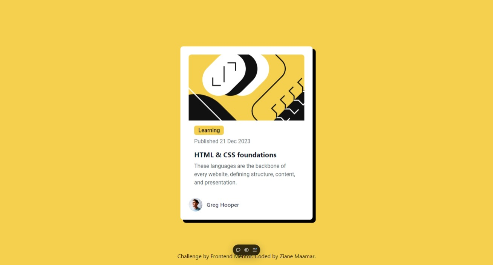

# Frontend Mentor - Blog preview card solution

This is a solution to the [Blog preview card challenge on Frontend Mentor](https://www.frontendmentor.io/challenges/blog-preview-card-ckPaj01IcS). Frontend Mentor challenges help you improve your coding skills by building realistic projects. 

## Table of contents

- [Overview](#overview)
  - [The challenge](#the-challenge)
  - [Screenshot](#screenshot)
  - [Links](#links)
- [My process](#my-process)
  - [Built with](#built-with)
  - [What I learned](#what-i-learned)
  - [Continued development](#continued-development)
  - [Useful resources](#useful-resources)
- [Author](#author)
- [Acknowledgments](#acknowledgments)

**Note: Delete this note and update the table of contents based on what sections you keep.**

## Overview

### The challenge

Users should be able to:

- See hover and focus states for all interactive elements on the page

### Screenshot

### Links

- Solution URL: [Code solution.](https://github.com/drxdesign/Blog-preview-card)
- Live Site URL: [live example.](https://blog-preview-card-black-nu.vercel.app/)

## My process
At first I had to create the full html base. after that I started making the style. using tailwind css. But for some reason I had to use simple CSS component or let's say custom css because you have to use the same colour that they give you for the challenge and the same font.

### Built with

- Semantic HTML5 markup
- CSS custom properties
- [Tailwind CSS](https://tailwindcss.com/) - For styles

**Note: These are just examples. Delete this note and replace the list above with your own choices**

### What I learned

Things that I've learned from this project is that I'm trying to master tailwind css because it's light, it's beautiful and it's easy to use Initially on a big scale apps. so I'm trying to master this for. bigger project.

### Continued development

So. what I'm going to try to focus next is making this same design, but using astrobuild and tailwind css and hopefully I can add a light and dark. theme I want to make it interactive so it can take you to another pages for a real blog.

### Useful resources

- [Tailwind CSS.](https://tailwindcss.com/) - I'm not gonna lie in some parts, especially when it comes to text and other stuff like that. I had to check the tailwind documentation. It truly helped me.

## Author

- Website - [Ziane Maamar](https://www.your-site.com)
- Frontend Mentor - [@drxdesign](https://www.frontendmentor.io/profile/drxdesign)
- Twitter - [@drxdesign](https://www.twitter.com/drxdesign)

